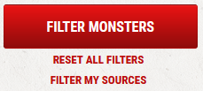

# Beyond My Content
Adds a button to DnDBeyond to filter content you own. Works with Violentmonkey extension and similar. Tested in Chrome and Firefox.

## How to install
1. Install [violentmonkey](https://violentmonkey.github.io/) browser extension.
2. Create a new script in extension.
3. Copy the content of the [script.js](script.js) from this repo.
4. Update the content you own in the `myContent` variable. Add `//` before the content you DON'T own.
5. Save the script in violentmonkey.
6. Reload DnDBeyond page.

[Greasy Fork](https://greasyfork.org/en/scripts/451010-beyond-my-content)
